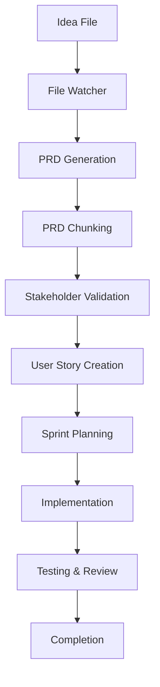
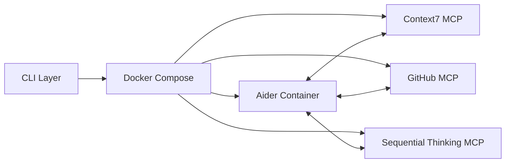

# Architecture

This document describes the system architecture and design decisions for AISDLC.

## Overview

AISDLC is designed as a distributed system that orchestrates AI agents to automate software development workflows. The architecture follows microservices patterns with containerized components communicating through well-defined interfaces.

## System Components

### CLI Layer
- **Purpose**: User interface and command orchestration
- **Technology**: oclif (Node.js/TypeScript)
- **Responsibilities**:
  - Command parsing and validation
  - Docker container management
  - File system operations
  - User feedback and logging

### Container Orchestration
- **Purpose**: Service isolation and scalability
- **Technology**: Docker Compose
- **Components**:
  - Aider container (main AI agent)
  - MCP server containers
  - File watcher services
  - Shared volume mounts

### MCP (Model Context Protocol) Servers
- **Context7 MCP**: Up-to-date library documentation
- **GitHub MCP**: Repository operations and code management
- **Sequential Thinking MCP**: Structured reasoning and planning

### File System Structure
```
.aisdlc/
├── 01_agents/           # Agent definitions and configurations
├── 02_prompts/          # Prompt templates for different stages
├── 03_ideas/            # Input directory for idea files
├── 04_backlog/          # Generated PRDs and user stories
├── 05_in_progress/      # Active development items
├── 06_done/             # Completed items
└── refs/                # Reference documentation
```

## Workflow Architecture

### Idea Processing Pipeline



### Agent Communication



## Design Decisions

### File-Based Triggers
**Decision**: Use file system events to trigger workflows
**Rationale**: 
- Simple and intuitive for users
- Language-agnostic integration
- Easy to debug and monitor
- Supports batch processing

### Docker-Based Architecture
**Decision**: Containerize all services
**Rationale**:
- Environment isolation
- Easy deployment and scaling
- Consistent development experience
- Service independence

### MCP Protocol Integration
**Decision**: Use Model Context Protocol for AI service communication
**Rationale**:
- Standardized AI agent communication
- Extensible architecture
- Tool and capability discovery
- Vendor-neutral approach

### TypeScript/Node.js for CLI
**Decision**: Use TypeScript and oclif framework
**Rationale**:
- Strong typing for reliability
- Rich ecosystem for CLI tools
- Good Docker integration
- Familiar to JavaScript developers

## Data Flow

### Input Processing
1. User drops idea file in `03_ideas/`
2. File watcher detects change
3. Aider agent reads file content
4. Sequential Thinking MCP processes idea structure
5. Context7 MCP provides relevant documentation

### PRD Generation
1. Planner agent analyzes idea
2. Context7 provides library documentation
3. GitHub MCP accesses codebase context
4. PRD generated and saved to `04_backlog/`

### Implementation Phase
1. User stories created from PRD chunks
2. Sprint planning assigns tasks to agents
3. Builder agents implement code changes
4. GitHub MCP handles repository operations
5. Reviewer agents validate implementations

## Security Considerations

### Container Security
- Non-root user execution
- Limited file system access
- Network isolation between services
- Secrets management through environment variables

### API Security
- MCP server authentication
- Rate limiting on external API calls
- Input validation and sanitization
- Secure credential storage

### File System Security
- Restricted access to `.aishell` directory
- Input file validation
- Safe file operations
- Backup and recovery procedures

## Scalability

### Horizontal Scaling
- Multiple Aider containers for parallel processing
- Load balancing across MCP servers
- Distributed file processing
- Queue-based task management

### Performance Optimization
- Caching of MCP responses
- Incremental file processing
- Lazy loading of documentation
- Efficient Docker image layers

## Monitoring and Observability

### Logging
- Structured logging across all components
- Centralized log aggregation
- Different log levels for debugging
- Performance metrics collection

### Health Checks
- Container health monitoring
- MCP server availability checks
- File system integrity validation
- Resource usage tracking

## Extension Points

### Custom Agents
- Plugin architecture for new agent types
- Configuration-driven agent behavior
- Custom prompt templates
- Tool integration framework

### MCP Server Extensions
- Custom MCP server development
- Third-party service integrations
- Domain-specific knowledge bases
- Custom reasoning engines

### Workflow Customization
- Configurable pipeline stages
- Custom validation rules
- Integration with external tools
- Custom notification systems
